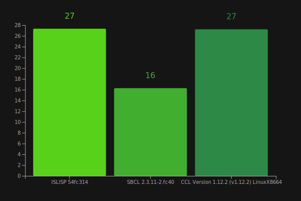
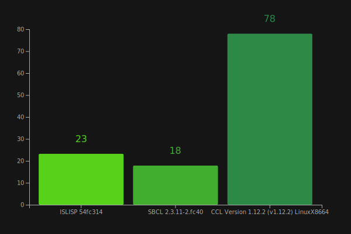

= Benchmarks

Benchmarks are mostly compared against Common Lisp implementations. CL has both more mature implementations, and it's also straight forward to transpose ISLISP code to CL quite directly

== Fibonacci numbers

Absolute classic, how could one go without it? Computes (fib 30) for 1000 times; measured in seconds.

== Brainfuck interpreter

Runs brainfuck interpreter, which interprets a brainfuck interpreter, which computes squares of numbers from 1 to 4; measured in seconds.

== Dyhnamic dispatch

Runs some adhoc generic methods, dynamically dispatching on iteration logic and fold logic; measured in seconds.

